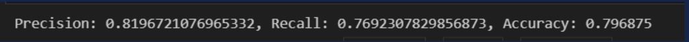
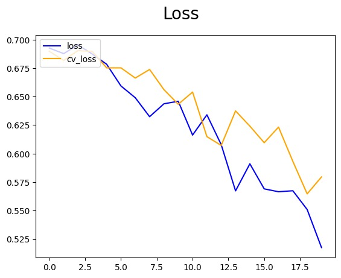
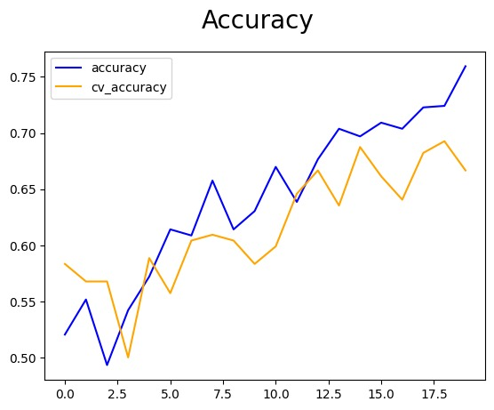

# AI Image Classification: Detecting AI-Generated vs. Real Images

This project focuses on classifying whether a given image is AI-generated or a real photograph using a Convolutional Neural Network (CNN). It was developed as a part of a Software Engineering course project and integrates both backend and frontend components.

## 🔍 Project Description

With the rise of AI-generated media, distinguishing between real and synthetic images has become crucial. This project leverages deep learning techniques to predict whether an uploaded image is a genuine photograph or generated by AI.

We use a CNN model trained on a small dataset of 1,085 images, classified into two categories: **REAL** and **FAKE**. The project includes a TensorFlow-based image classifier and a simple frontend interface connected using Flask.

## 📊 Model Performance

The model achieved the following evaluation metrics on the test set:

- **Precision:** 81.96%
- **Recall:** 76.92%
- **Accuracy:** 79.68%

  

### Loss & Accuracy During Training

  
  

> Note: Due to limited data (~1,085 samples), the model's performance is moderate. Higher accuracy could be achieved with larger datasets, but high-resolution AI/real images require significant memory (11–20GB).

## 🧠 Technologies Used

- Python
- TensorFlow / Keras
- OpenCV
- Flask (for frontend integration)
- Matplotlib (for visualization)

## 🧪 How It Works

1. User uploads an image via frontend.
2. Image is resized to 32x32 pixels and normalized.
3. The pre-trained CNN model (.h5 file) makes a prediction.
4. The model predicts its class:
   - Output > 0.5 → **REAL**
   - Output ≤ 0.5 → **FAKE (AI-generated)**

## 🧠 Model Training
To retrain the model or test with your own dataset, use the Google Colab notebook below:

👉 ([link](https://drive.google.com/file/d/1_c1op6PmpNtQExVVhEgGBJtlegPplhql/view?usp=sharing))

## 🗂 Project Structure

AI-Image-Classification/ /n
├── backend/                  # Flask app and model inference
│   ├── app.py
│   └── train(colab).py
│   └── ai_imageclassifier.h5
├── dataset/                  # Dataset (REAL / FAKE)
│   ├── REAL/
│   └── FAKE/
├── frontend/                 # React
│   ├── public/
│   └── src/
├── performance/              # Training result visualizations
│   ├── loss.png
│   ├── accuracy.png
│   └── metrics.png
└── README.md

## 📌 Future Improvements
1. Use larger datasets with more diversity and resolution.
2. Fine-tune model using pre-trained architectures (e.g., ResNet, EfficientNet).
3. Add adversarial image detection features.
